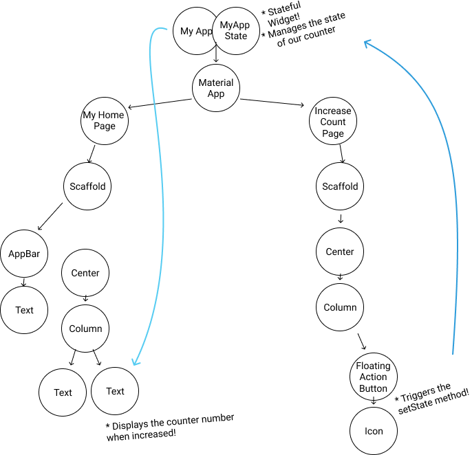
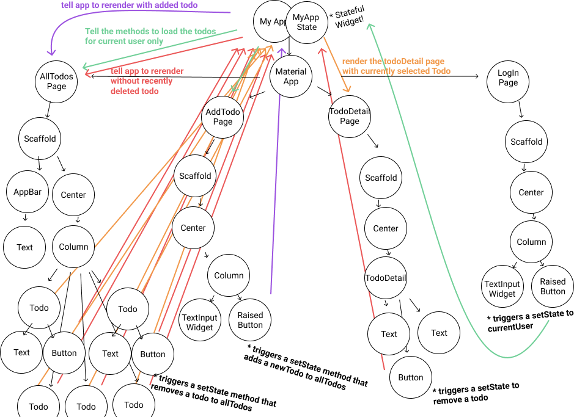
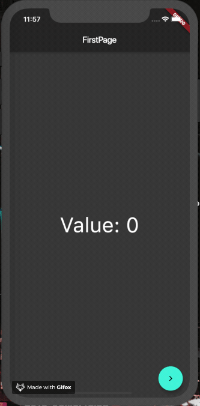
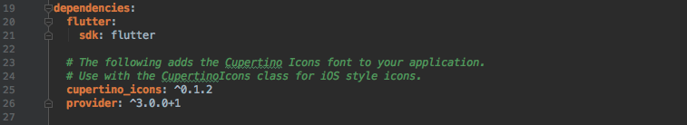
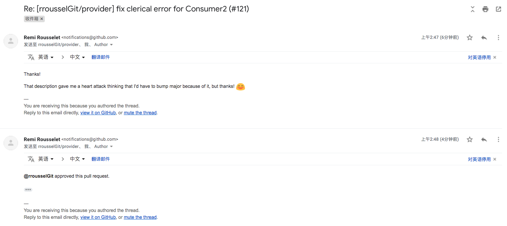
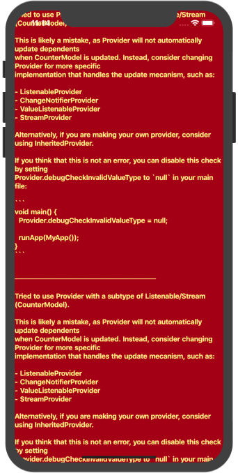

# Flutter | 状态管理指南篇——Provider

# 前言

2019 Google I/O 大会，官方在 [Pragmatic State Management in Flutter (Google I/O'19)](https://www.youtube.com/watch?v=d_m5csmrf7I&list=PLjxrf2q8roU2no7yROrcQSVtwbYyxAGZV&index=3) 主题演讲上正式介绍了 由社区作者 [Remi Rousselet](https://github.com/rrousselGit) 与 Flutter Team 共同编写的 [Provider](https://github.com/rrousselGit/provider)  代替 Provide 成为官方推荐的状态管理方式之一。

本文将基于最新 Provider v-3.0 进行介绍，除了讲解其使用方式之外，我认为更重要的是 Provider 不同“提供”方式的适用场景及使用原则。以及在使用状态管理时候**需要遵守的原则**，在编写 Flutter App 的过程中减轻你的思考负担。希望本文能给你带来一些有价值的参考。（提前打个预防针，本文篇幅较长，建议马住在看。）

推荐阅读时间：**1小时**

# What's the problem
在正式介绍 Provider 之前允许我再啰嗦两句，为什么我们需要状态管理。如果你已经对此十分清楚，那么建议直接跳过这一节。

如果我们的应用足够简单，Flutter 作为一个声明式框架，你或许只需要将 **数据** 映射成 **视图** 就可以了。你可能并不需要状态管理，就像下面这样。



但是随着功能的增加，你的应用程序将会有几十个甚至上百个状态。这个时候你的应用应该会是这样。



这是什么鬼。我们很难再清楚的测试维护我们的状态，因为它看上去实在是太复杂了！而且还会有多个页面共享同一个状态，例如当你进入一个文章点赞，退出到外部缩略展示的时候，外部也需要显示点赞数，这时候就需要同步这两个状态。

Flutter 实际上在一开始就为我们提供了一种状态管理方式，那就是 **StatefulWidget**。但是我们很快发现，它正是造成上述原因的**罪魁祸首**。

在 State 属于某一个特定的 Widget，在多个 Widget 之间进行交流的时候，虽然你可以使用 callback 解决，但是当嵌套足够深的话，我们增加非常多可怕的垃圾代码。 

这时候，我们便迫切的需要一个架构来帮助我们理清这些关系，状态管理框架应运而生。

# What is Provider 
Provider 从名字上就很容易理解，它就是用于提供数据，无论是在**单个页面**还是在**整个** app 都有它自己的解决方案，我们可以很方便的管理状态。可以说，Provider 的目标就是**完全替代** StatefulWidget。

说了很多还是很抽象，我们先一起做一个最简单的例子。

# How to do
这里我们还是用这个 Counter App 为例，给大家介绍如何在两个独立的页面中共享计数器（counter）的状态应该怎么做,具体长这样。



两个页面中心字体共用了同一个字体大小。第二个页面的按钮将会让数字增加，第一个页面的数字将会同步增加。

## 第一步：添加依赖
在pubspec.yaml中添加Provider的依赖。



- 实际添加请参考：https://pub.dev/packages/provider#-installing-tab-
- 由于版本冲突添加失败请参考: https://juejin.im/post/5b8958d351882542b03e6d57

## 第二步：创建数据 Model
这里的 Model 实际上就是我们的状态，它不仅储存了我们的数据模型，而且还包含了更改数据的方法，并暴露出它想要暴露出的数据。

``` dart
import 'package:flutter/material.dart';

class CounterModel with ChangeNotifier {
  int _count = 0;
  int get value => _count;

  void increment() {
    _count++;
    notifyListeners();
  }
}
```
这个类意图非常清晰，我们的数据就是一个 int 类型的 `_count`，下划线代表私有。通过 `get value` 把 `_count` 值暴露出来。并提供 `increment` 方法用于更改数据。

这里使用了 mixin 混入了 `ChangeNotifier`，这个类能够帮驻我们自动管理所有听众。当调用 `notifyListeners()` 时，它会通知所有听众进行刷新。

如果你对 mixin 这个概念还不是很清楚的话，可以看我之前翻译的这篇 [【译】Dart | 什么是Mixin](https://juejin.im/post/5bb204d3e51d450e4f38e2f6)。

## 第三步：创建顶层共享数据
我们在 main 方法中初始化全局数据。
``` dart
void main() {
  final counter = CounterModel();
  final textSize = 48;

  runApp(
    Provider<int>.value(
      value: textSize,
      child: ChangeNotifierProvider.value(
        value: counter,
        child: MyApp(),
      ),
    ),
  );
}
```
通过 `Provider<T>.value` 能够管理一个恒定的数据，并提供给子孙节点使用。我们只需要将数据在其 value 属性中声明即可。在这里我们将 `textSize` 传入。

而 `ChangeNotifierProvider<T>.value` 不仅能够提供数据供子孙节点使用，还可以在数据改变的时候通知所有听众刷新。(通过之前我们说过的 `notifyListeners`)

此处的 `<T>` 范型可省略。但是我建议大家还是进行声明，这会使你的应用更加健壮。

除了上述几个属性之外 `Provider<T>.value` 还提供了 `UpdateShouldNotify` Function，用于控制刷新时机。

`typedef UpdateShouldNotify<T> = bool Function(T previous, T current);`

我们可以在这里传入一个方法 `(T previous, T current){...}` ，并获得前后两个 Model 的实例，然后通过比较两个 Model 以自定义刷新规则，返回 bool 表示是否需要刷新。默认为 previous != current 则刷新。

当然，key 属性是肯定有的，常规操作。如果你还不太清楚的话，建议阅读我之前的这篇文章 [Flutter | 深入浅出Key] (https://juejin.im/post/5ca2152f6fb9a05e1a7a9a26。)

为了让各位思维连贯，我还是在这里放上这个平淡无奇的 MyApp Widget 代码。😑
``` dart
class MyApp extends StatelessWidget {
  @override
  Widget build(BuildContext context) {
    return MaterialApp(
      theme: ThemeData.dark(),
      home: FirstScreen(),
    );
  }
}
```

## 第四步：在子页面中获取状态
在这里我们有两个页面，FirstScreen 和 SecondScreen。我们先来看 FirstScreen 的代码。

### Provider.of<T>(context)

``` dart
class FirstScreen extends StatelessWidget {
  @override
  Widget build(BuildContext context) {
    final _counter = Provider.of<CounterModel>(context);
    final textSize = Provider.of<int>(context).toDouble();

    return Scaffold(
      appBar: AppBar(
        title: Text('FirstPage'),
      ),
      body: Center(
        child: Text(
          'Value: ${_counter.value}',
          style: TextStyle(fontSize: textSize),
        ),
      ),
      floatingActionButton: FloatingActionButton(
        onPressed: () => Navigator.of(context)
            .push(MaterialPageRoute(builder: (context) => SecondPage())),
        child: Icon(Icons.navigate_next),
      ),
    );
  }
}
```

获取顶层数据最简单的方法就是 `Provider.of<T>(context);` 这里的范型 `<T>` 指定了获取 **FirstScreen** 向上寻找最近的储存了 T 的祖先节点的数据。

我们通过这个方法获取了顶层的 CounterModel 及 textSize。并在 Text 组件中进行使用。

floatingActionButton 用来点击跳转到 SecondScreen 页面，和我们的主题无关。

### Consumer
看到这里你可能会想，两个页面都是获取顶层状态，代码不都一样吗，弄啥捏。🤨 别忙着跳到下一节，我们来看另外一种获取状态的方式，这将会影响你的 app performance。

``` dart
class SecondPage extends StatelessWidget {
  @override
  Widget build(BuildContext context) {
    return Scaffold(
      appBar: AppBar(
        title: Text('Second Page'),
      ),
      body: Consumer2<CounterModel,int>(
        builder: (context, CounterModel counter, int textSize, _) => Center(
              child: Text(
                'Value: ${counter.value}',
                style: TextStyle(
                  fontSize: textSize.toDouble(),
                ),
              ),
            ),
      ),
      floatingActionButton: Consumer<CounterModel>(
        builder: (context, CounterModel counter, child) => FloatingActionButton(
              onPressed: counter.increment,
              child: child,
            ),
        child: Icon(Icons.add),
      ),
    );
  }
}
```
这里我们要介绍的是第二种方式，使用 Consumer 获取祖先节点中的数据。

在这个页面中，我们有两处使用到了公共 Model。
- 应用中心的文字：使用 CounterModel 在 Text 中展示文字，以及通过 textSize 定义自身的大小。一共使用到了两个 Model。
- 浮动按钮：使用 CounterModel 的 `increment` 方法触发计数器的值增加。使用到了一个 Model。

#### Single Model Consumer
我们先看 floatingActionButton，使用了一个 Consumer 的情况。

Consumer 使用了 [**Builder**](https://en.wikipedia.org/wiki/Builder_pattern) 模式，收到更新通知就会通过 builder 重新构建。`Consumer<T>` 代表了它要获取哪一个祖先中的 Model。

Consumer 的 builder 实际上就是一个 Function，它接收三个参数 `(BuildContext context, T model, Widget child)`。 
- context： context 就是 build 方法传进来的 BuildContext 在这里就不细说了，如果有兴趣可以看我之前这篇文章 [Flutter | 深入理解BuildContext](https://juejin.im/post/5c665cb651882562914ec153)。
- T：T也很简单，就是获取到的最近一个祖先节点中的数据模型。
- child：它用来构建那些与 Model 无关的部分，在多次运行 builder 中，child 不会进行重建。

然后它会返回一个通过这三个参数映射的 Widget 用于构建自身。

在这个浮动按钮的例子中，我们通过 **Consumer** 获取到了顶层的 `CounterModel` 实例。并在浮动按钮 onTap 的 callback 中调用其 `increment` 方法。

而且我们成功抽离出 **Consumer** 中不变的部分，也就是浮动按钮中心的 `Icon` 并将其作为 child 参数传入 builder 方法中。

#### Consumer2
现在我们再来看中心的文字部分。这时候你可能会有疑惑了，刚才我们讲的  Consumer 获取的只有一个 Model，而现在 Text 组件不仅需要 CounterModel 用以显示计数器，而且还需要获得 textSize 以调整字体大小，咋整捏。

遇到这种情况你可以使用 `Consumer2<A,B>`。使用方式基本上和 `Consumer<T>` 一致，只不过范型改为了两个，并且 builder 方法也变成了 `Function(BuildContext context, A value, B value2, Widget child)`。

我勒个去...假如我要获得 100 个 Model，那岂不是得搞个 Consumer100 (???黑人问号.jpg) 

然而并没有 😏。

从源码里面可以看到，作者只为我们搞到了 `Consumer6`。emmmmm.....还要要求更多就只有自力更生喽。

顺手帮作者修复了一个 clerical error。



#### 区别
我们来看 Consumer 的内部实现。
``` dart
@override
  Widget build(BuildContext context) {
    return builder(
      context,
      Provider.of<T>(context),
      child,
    );
  }
```
可以发现，`Consumer` 就是通过 `Provider.of<T>(context)` 来实现的。但是从实现来讲 `Provider.of<T>(context)` 比 `Consumer` 简单好用太多，为啥我要搞得那么复杂捏。

实际上 `Consumer` 非常有用，它的经典之处在于能够在复杂项目中，**极大地缩小你的控件刷新范围**。`Provider.of<T>(context)` 将会把调用了该方法的 context 作为听众，并在 `notifyListeners` 的时候通知其刷新。

举个例子来说，我们的 FirstScreen 使用了 `Provider.of<T>(context)` 来获取数据，SecondScreen 则没有。
- 你在 FirstScreen 中的 build 方法中添加一个 `print('first screen rebuild');`
- 然后在 SecondScreen 中的 build 方法中添加一个 `print('second screen rebuild');`
- 点击第二个页面的浮动按钮，那么你会在控制台看到这句输出。

**first screen rebuild**

首先这证明了 `Provider.of<T>(context)` 会导致调用的 context 页面范围的刷新。

那么第二个页面刷新没有呢？ 刷新了，但是只刷新了 `Consumer` 的部分，甚至连浮动按钮中的 `Icon` 的不刷新我们都给控制了。你可以在  `Consumer` 的 builder 方法中验证，这里不再啰嗦

假如你在你的应用的 **页面级别** 的 Widget 中，使用了 `Provider.of<T>(context)`。会导致什么后果已经显而易见了，每当其状态改变的时候，你都会重新刷新整个页面。虽然你有 Flutter 的自动优化算法给你撑腰，但你肯定**无法获得最好的性能**。

所以在这里我建议各位尽量使用 `Consumer` 而不是 `Provider.of<T>(context)` 获取顶层数据。

以上便是一个最简单的使用 Provider 的例子。
# You also need to know
## 合理选择使用 Provides 的构造方法
在上面这个例子中👆，我们选择了使用 `XProvider<T>.value` 的构造方法来创建祖先节点中的 提供者。除了这种方式，我们还可以使用默认构造方法。
``` dart
Provider({
    Key key,
    @required ValueBuilder<T> builder,
    Disposer<T> dispose,
    Widget child,
  }) : this._(
          key: key,
          delegate: BuilderStateDelegate<T>(builder, dispose: dispose),
          updateShouldNotify: null,
          child: child,
        );
```
常规的 key/child 属性我们不在这里啰嗦。我们先来看这个看上去相对教复杂一点的 builder。

### ValueBuilder
相比起 `.value` 构造方式中直接传入一个 value 就 ok，这里的 builder 要求我们传入一个 ValueBuilder。WTF？

`typedef ValueBuilder<T> = T Function(BuildContext context);`

其实很简单，就是传入一个 Function 返回一个数据而已。在上面这个例子中，你可以替换成这样。

``` dart
Provider(
    builder: (context) => textSize,
    ...
)
```

由于是 Builder 模式，这里默认需要传入 context，实际上我们的 Model（textSize）与 context 并没有关系，所以你完全可以这样写。

``` dart
Provider(
    builder: (_) => textSize,
    ...
)
```
### Disposer
现在我们知道了 builder，那这个 dispose 方法又用来做什么的呢。实际上这才是 Provider 的点睛之笔。

`typedef Disposer<T> = void Function(BuildContext context, T value);`

dispose 属性需要一个 `Disposer<T>`,而这个其实也是一个回调。

如果你之前使用过 BLoC 的话，相信你肯定遇到过一个头疼的问题。我应该在什么时候释放资源呢？ BloC 使用了观察者模式，它旨在替代 StatefulWidget。然而大量的流使用完毕之后必须 close 掉，以释放资源。

然而 Stateless Widget 并没有给我们类似于 dispose 之类的方法，这便是 BLoC 的硬伤。你不得不为了释放资源而使用 StatefulWidget，这与我们的本意相违。而 Provider 则为我们解决了这一点。

当 Provider 所在节点被移除的时候，它就会启动 `Disposer<T>`，然后我们便可以在这里释放资源。

举个例子，假如我们有这样一个 BLoC。
``` dart
class ValidatorBLoC {
  StreamController<String> _validator = StreamController<String>.broadcast();

  get validator => _validator.stream;

  validateAccount(String text) {
    //Processing verification text ...
  }

  dispose() {
    _validator.close();
  }
}
```

这时候我们想要在某个页面提供这个 BLoC 但是又不想使用 StatefulWidget。这时候我们可以在页面顶层套上这个 Provider。

``` dart
Provider(
    builder:(_) => ValidatorBLoC(),
    dispose:(_, ValidatorBLoC bloc) => bloc.dispose(),
    }
)
```
这样就完美解决了数据释放的问题！🤩

现在我们可以放心的结合 BLoC 一起使用了，很赞有没有。但是现在你可能又有疑问了，在使用 Provider 的时候，我应该选择哪种构造方法呢。

我的推荐是，**简单模型**就选择 `Provider<T>.value`，好处是可以精确控制刷新时机。而需要对资源进行释放处理等**复杂模型**的时候，`Provider()` 默认构造方式绝对是你的最佳选择。

其他几种 Provider 也遵循该模式，需要的时候可以自行查看源码。

## 我该使用哪种 Provider
如果你在 Provider 中提供了可监听对象（Listenable 或者 Stream）及其子类的话，那么你会得到下面这个异常警告。



你可以将本文中所使用到的 CounterModel 放入 Provider 进行提供（记得 hot restart 而不是 hot reload），那么你就能看到上面这个 FlutterError 了。

你也可以在 main 方法中通过下面这行代码来禁用此提示。
`Provider.debugCheckInvalidValueType = null;`

这是由于 Provider 只能提供恒定的数据，不能通知依赖它的子部件刷新。提示也说的很清楚了，假如你想使用一个会发生 change 的 Provider，请使用下面的 Provider。
- ListenableProvider
- ChangeNotifierProvider
- ValueListenableProvider
- StreamProvider

你可能会在这里产生一个疑问，不是说（Listenable 或者 Stream）才不行吗，为什么我们的 CounterModel 混入的是 ChangeNotifier 但是还是出现了这个 FlutterError 呢。

`class ChangeNotifier implements Listenable `

我们再来看上面的这几个 Provider 有什么异同。先关注 `ListenableProvider / ChangeNotifierProvider` 这两个类。

ListenableProvider 提供（provide）的对象是**继承**了 Listenable 抽象类的子类。由于无法混入，所以通过继承来获得 Listenable 的能力，同时必须实现其 `addListener / removeListener` 方法，手动管理收听者。显然，这样太过复杂，我们通常都不需要这样做。

而混入了 `ChangeNotifier` 的类自动帮我们实现了听众管理，所以 ListenableProvider 同样也可以接收混入了 ChangeNotifier 的类。

ChangeNotifierProvider 则更为简单，它能够对子节点提供一个 **继承** / **混入** / **实现** 了 ChangeNotifier 的类。通常我们只需要在 Model 中 `with ChangeNotifier` ，然后在需要刷新状态的时候调用 `notifyListeners` 即可。

那么 **ChangeNotifierProvider** 和 **ListenableProvider** 究竟区别在哪呢，**ListenableProvider** 不是也可以提供（provide）混入了 ChangeNotifier 的 Model 吗。

还是那个你需要思考的问题。你在这里的 Model 究竟是一个简单模型还是复杂模型。这是因为 ChangeNotifierProvider 会在你需要的时候，自动调用其 _disposer 方法。

`static void _disposer(BuildContext context, ChangeNotifier notifier) =>
      notifier?.dispose();`

我们可以在 Model 中重写 ChangeNotifier 的 dispose 方法，来释放其资源。这对于复杂 Model 的情况下十分有用。

现在你应该已经十分清楚 `ListenableProvider / ChangeNotifierProvider` 的区别了。下面我们来看 ValueListenableProvider。

ValueListenableProvider 用于提供实现了 **继承** / **混入** / **实现** 了 ValueListenable 的 Model。它实际上是专门用于处理只有一个单一变化数据的 ChangeNotifier。

`class ValueNotifier<T> extends ChangeNotifier implements ValueListenable<T>`

通过 ValueListenable 处理的类**不再需要**数据更新的时候调用 `notifyListeners`。

好了，终于只剩下最后一个 `StreamProvider` 了。

`StreamProvider` 专门用作提供（provide）一条 Single Stream。我在这里仅对其核心属性进行讲解。

- `T initialData`：你可以通过这个属性声明这条流的初始值。
- `ErrorBuilder<T> catchError`：这个属性用来捕获流中的 error。在这条流 addError 了之后，你会能够通过 ` T Function(BuildContext context, Object error)` 回调来处理这个异常数据。实际开发中它非常有用。
- `updateShouldNotify`：和之前的回调一样，这里不再赘述。

除了这三个构造方法都有的属性以外，StreamProvider 还有三种不同的构造方法。
- `StreamProvider(...)`：默认构造方法用作创建一个 Stream 并收听它。
- `StreamProvider.controller(...)`：通过 builder 方式创建一个 `StreamController<T>`。并且在 StreamProvider 被移除时，自动释放 StreamController。
- `StreamProvider.value(...)`：监听一个已有的 Stream 并将其 value 提供给子孙节点。

除了上面这五种已经提到过的 Provider，还有一种 FutureProvider，它提供了一个 Future 给其子孙节点，并在 Future 完成时，通知依赖的子孙节点进行刷新，这里不再详细介绍，需要的话自行查看 api 文档。
## 优雅地处理多个 Provider
在我们之前的例子中，我们使用了嵌套的方式来组合多个 Provider。这样看上去有些傻瓜（我就是有一百个 Model 🙃）。

这时候我们就可以使用一个非常 sweet 的组件 —— `MultiProvider`。

这时候我们刚才那个例子就可以改成这样。
```dart
void main() {
  final counter = CounterModel();
  final textSize = 48;

  runApp(
    MultiProvider(
      providers: [
        Provider.value(value: textSize),
        ChangeNotifierProvider.value(value: counter)
      ],
      child: MyApp(),
    ),
  );
}
```

我们的代码瞬间清晰很多，而且与刚才的嵌套做法**完全等**价。

# Tips
## 保证 build 方法无副作用
build 无副作用也通常被人叫做，build 保持 pure，二者是一个意思。

通常我们经常会看到，为了获取顶层数据我们会在 build 方法中调用 XXX.of(context) 方法。你必须**非常小心**，你的 build 函数不应该产生任何副作用，包括新的对象（Widget 以外），请求网络，或作出一个映射视图以外的操作等。

这是因为，你的根本无法控制什么时候你的 build 函数将会被调用。我可以说**随时**。每当你的 build 函数被调用，那么都会产生一个副作用。这将会发生非常恐怖的事情。🤯

我这样说你肯定会感到比较抽象，我们来举一个例子。

假如你有一个 `ArticleModel` 这个 Model 的作用是 **通过网络** 获取一页 List 数据，并用 ListView 显示在页面上。

这时候，我们假设你在 build 函数中做了下面这些事情。

``` dart
@override
  Widget build(BuildContext context) {
      final articleModel = Provider.of<ArticleModel>(context);
      mainCategoryModel.getPage(); // By requesting data from the server
      return XWidget(...);
  }
```

我们在 build 函数中获得了祖先节点中的 articleModel，随后调用了 getPage 方法。

这时候会发生什么事情呢，当我们请求成功获得了结果的时候，根据之前我们已经介绍过的，调用了 `Provider.of<T>(context);` 会重新运行其 build。这样 getPage 就又被执行了一次。

而你的 Model 中每次请求 getPage 都会导致 Model 中保存的当前请求页自增（第一次请求第一页的数据，第二次请求第二页的数据以此类推），那么每次 build 都会导致新的一次数据请求，并在新的数据 get 的时候请求下一页的数据。你的服务器挂掉那是迟早的事情。（come on baby！

> 由于 didChangeDependence 方法也会随着依赖改变而被调用，所以也需要保证它没有副作用。具体解释参见下面单页面数据初始化。

所以你应该严格遵守这项原则，否则会导致一系列糟糕的后果。

那么怎么解决数据初始化这个问题呢，请看 Q&A 部分。

## 不要所有状态都放在全局
第二个小贴士是不要把你的所有状态都放在顶层。开发者为了图方便省事，再接触了状态管理之后经常喜欢把所有东西都放在顶层 MaterialApp 之上。这样看上去就很方便共享数据了，我要数据就直接去获取。

不要这么做。严格区分你的全局数据与局部数据，资源不用了就要释放！否则将会严重影响你的应用 performance。

## 尽量在 Model 中使用私有变量“_”
这可能是我们每个人在新手阶段都会出现的疑问。为什么要用私有变量呢，我在任何地方都能够操作成员不是很方便吗。

一个应用需要大量开发人员参与，你写的代码也许在几个月之后被另外一个开发看到了，这时候假如你的变量没有被保护的话，也许同样是让 count++，他会用 countController.sink.add(++_count) 这种原始方法，而不是调用你已经封装好了的 increment 方法。

虽然两种方式的效果完全一样，但是第二种方式将会让我们的business logic零散的混入其他代码中。久而久之项目中就会大量充斥着这些垃圾代码增加项目代码耦合程度，非常不利于代码的维护以及阅读。

所以，请务必使用私有变量保护你的 Model。
## 控制你的刷新范围
在 Flutter 中，**组合**大于**继承**的特性随处可见。常见的 Widget 实际上都是由更小的 Widget 组合而成，直到基本组件为止。为了使我们的应用拥有更高的性能，控制 Widget 的刷新范围便显得至关重要。

我们已经通过前面的介绍了解到了，在 Provider 中获取 Model 的方式会影响刷新范围。所有，请尽量使用 Consumer 来获取祖先 Model，以维持最小刷新范围。

# Q&A
在这里对一些大家可能会有疑问的常见问题做一个回答，如果你还有这之外的疑问的话，欢迎在下方评论区一起讨论。
## Provider 是如何做到状态共享的
这个问题实际上得分两步。
### 获取顶层数据
实际上在祖先节点中共享数据这件事我们已经在之前的文章中接触过很多次了，都是通过系统的 InheritedWidget 进行实现的。

Provider 也不例外，在所有 Provider 的 build 方法中，返回了一个 InheritedProvider。

`class InheritedProvider<T> extends InheritedWidget`

Flutter 通过在每个 Element 上维护一个 `InheritedWidget` 哈希表来向下传递 Element 树中的信息。通常情况下，多个
Element 引用相同的哈希表，并且该表仅在 Element 引入新的 `InheritedWidget` 时改变。

所以寻找祖先节点的时间复杂度为 O(1) 😎
### 通知刷新
通知刷新这一步实际上在讲各种 Provider 的时候已经讲过了，其实就是使用了 Listener 模式。Model 中维护了一堆听众，然后 notifiedListener 通知刷新。（空间换时间🤣 

## 为什么全局状态需要放在顶层 MaterialApp 之上
这个问题需要结合 Navigator 以及 BuildContext 来回答，在之前的文章中 [Flutter | 深入理解BuildContext](https://juejin.im/post/5c665cb651882562914ec153) 已经解释过了，这里不再赘述。

## 我应该在哪里进行数据初始化
对于数据初始化这个问题，我们必须要分类讨论。
### 全局数据
当我们需要获取全局顶层数据（就像之前 CounterApp 例子一样）并需要做一些会产生额外结果的时候，main 函数是一个很好的选择。

我们可以在 main 方法中创建 Model 并进行初始化的工作，这样就只会执行一次。
### 单页面
如果我们的数据只是在这个页面中需要使用，那么你有这两种方式可以选择。
#### StatefulWidget
这里订正一个错误，感谢 @晓杰的V笑 以及 @fantasy525 在讨论中帮我指出。

在之前文章的版本中我推荐大家在 State 的 didChangeDependence 中进行数据初始化。这里其实是使用 BLoC 延续下来的习惯。因为使用了 InheritWidget 之后，只有在 State 的 didChangeDependence 阶段进行 Inherit 初始化，initState 阶段是拿不到数据的。而由于 BLoC 是使用的 Stream，数据直接走 Stream 进来，由 StreamBuilder 去 listen，这样 State 的依赖一直都只是这个 Stream 对象而已，不会再次触发 didChangeDependence 方法。那 Provider 有何不同呢。

``` dart
  /// If [listen] is `true` (default), later value changes will trigger a new
  /// [State.build] to widgets, and [State.didChangeDependencies] for
  /// [StatefulWidget].
```
源码中的注释解释了，如果这个 `Provider.of<T>(context)` listen 了的话，那么当 notifyListeners 的时候，就会触发 context 所对应的 State 的 [State.build] 和 [State.didChangeDependencies] 方法。也就是说，如果你使用了非 Provider 提供的数据，例如 ChangeNotifierProvider 这样会改变依赖的类，并且获取数据时 `Provider.of<T>(context, listen: true)` 选择 listen （默认就为 listen）的话，数据刷新时会重新运行 didChangeDependencies 和 build 两个方法。这样一来对 didChangeDependencies 也会产生副作用。假如在这里请求了数据，当数据到来的时候，又回触发下一次请求，最终无限请求下去。

这里除了副作用以外还有一点，假如数据改变是一个同步行为，例如这里的 counter.increment 这样的方法，在 didChangeDependencies 中调用的话，就会造成下面这个错误。
```
The following assertion was thrown while dispatching notifications for CounterModel:
flutter: setState() or markNeedsBuild() called during build.
flutter: This ChangeNotifierProvider<CounterModel> widget cannot be marked as needing to build because the
flutter: framework is already in the process of building widgets. A widget can be marked as needing to be
flutter: built during the build phase only if one of its ancestors is currently building. This exception is
flutter: allowed because the framework builds parent widgets before children, which means a dirty descendant
flutter: will always be built. Otherwise, the framework might not visit this widget during this build phase.
```
这里和和 Flutter 的构建算法有关。简单来说，就是不能够在 State 的 build 期间调用 setState() 或者 markNeedsBuild()，在我们这里 didChangeDependence 的时候调用了此方法，导致出现这个错误。异步数据则会由于 event loop 的缘故不会立即执行。想要深入了解的同学可以看闲鱼技术的这篇文章：[Flutter快速上车之Widget](https://juejin.im/post/5b8ce76f51882542c0626887)。

感觉处处都是坑啊，那该怎么初始化呢。目前我找到的办法是这样，首先 要保证初始化数据不能够产生副作用，我们需要找一个在 State 声明周期内**一定**只会运行一次的方法。initState 就是为此而生的。但是 initState 不是无法获取到 Inherit 吗。但是我们现在本身就在页面顶层啊，页面级别的 Model 就在顶层被创建，现在根本就不需要 Inherit。

``` dart
class _HomeState extends State<Home> {
    final _myModel = MyModel();
    
      @override
  void initState() {
    super.initState();
    _myModel.init(); 
  }
}
```
页面级别的 Model 数据都在页面顶层 Widget 创建并初始化即可。

我们还需要考虑一种情况，假如这个操作是一个同步操作应该如何处理，就如我们之前举的 CounterModel.increment 这个操作一样。

``` dart
 void initState() {
    super.initState();
    WidgetsBinding.instance.addPostFrameCallback((callback){
      Provider.of<CounterModel>(context).increment();
    });
  }
```
我们通过 addPostFrameCallback 回调中在第一帧 build 结束时调用 increment 方法，这样就不会出现构建错误了。

##### provider 作者 Remi 给出了另外一种方式

> This code is relatively unsafe. There's more than one reason for didChangeDependencies to be called.

> You probably want something similar to:
``` dart
MyCounter counter;

@override
void didChangeDependencies() {
  final counter = Provider.of<MyCounter>(context);
  if (conter != this.counter) {
    this.counter = counter;
    counter.increment();
  }
}
```
> This should trigger increment only once.

也就是说初始化数据之前判断一下这个数据是否已经存在。

#### cascade
你也可以在使用 dart 的级连语法 `..do()` 直接在页面的 StatelessWidget 成员变量声明时进行初始化。

``` dart
class FirstScreen extends StatelessWidget {
    CounterModel _counter = CounterModel()..increment();
    double _textSize = 48;
    ...
}
```
使用这种方式需要注意，当这个 StatelessWidget 重新运行 build 的时候，状态会丢失。这种情况在 TabBarView 中的子页面切换过程中就可能会出现。

所以建议还是使用第一种，在 State 中初始化数据。


## 我需要担心性能问题吗
是的，无论 Flutter 再怎么努力优化，Provider 考虑的情况再多，我们总是有办法让应用卡爆 😂（开个玩笑）

仅当我们不遵守其行为规范的时候，会出现这样的情况。性能会因为你的各种不当操作而变得很糟糕。我的建议是：遵守其规范，做任何事情都考虑对性能的影响，要知道 Flutter 把更新算法可是优化到了 O(N)。

Provider 仅仅是对 InheritedWidget 的一个升级，你不必担心引入 Provider 会对应用造成性能问题。

## 为什么选择 Provider
Provider 不仅做到了提供数据，而且它拥有着一套完整的解决方案，覆盖了你会遇到的绝大多数情况。就连 BLoC 未解决的那个棘手的 dispose 问题，和 ScopedModel 的侵入性问题，它也都解决了。

然而它就是完美的吗，并不是，至少现在来说。Flutter Widget 构建模式很容易在 UI 层面上组件化，但是仅仅使用 Provider，Model 和 View 之间还是容易产生依赖。

我们只有通过手动将 Model 转化为 ViewModel 这样才能消除掉依赖关系，所以假如各位有组件化的需求，还需要另外处理。

不过对于大多数情况来说，Provider 足以优秀，它能够让你开发出**简单**、**高性能**、**层次清晰** 的应用。

## 我应该如何选择状态管理
介绍了这么多状态管理，你可能会发现，一些状态管理之间职责并不冲突。例如 BLoC 可以结合 RxDart 库变得很强大，很好用。而 BLoC 也可以结合 Provider / ScopedModel 一起使用。那我应该选择哪种状态管理方式呢。

我的建议是遵守以下几点：
1. 使用状态管理的目的是为了让编写代码变得更简单，任何会增加你的应用复杂度的状态管理，统统都不要用。
2. 选择自己能够 hold 住的，BLoC / Rxdart / Redux / Fish-Redux 这些状态管理方式都有一定上手难度，不要选自己无法理解的状态管理方式。
3. 在做最终决定之前，敲一敲 demo，真正感受各个状态管理方式给你带来的 好处/坏处 然后再做你的决定。

希望能够帮助到你。

# 源码浅析
## Flutter 中的 Builder 模式
在 Provider 中，各种 Provider 的原始构造方法都有一个 builder 参数，这里一般就用 `(_) => XXXModel()` 就行了。感觉有点多次一举，为什么不能像 `.value()` 构造方法那样简洁呢。

实际上，Provider 为了帮我们管理 Model，使用到了 delegation pattern。

builder 声明的 ValueBuilder 最终被传入代理类 `BuilderStateDelegate` / `SingleValueDelegate`。 然后通过代理类才实现的 Model 生命周期管理。

``` dart
class BuilderStateDelegate<T> extends ValueStateDelegate<T> {
  BuilderStateDelegate(this._builder, {Disposer<T> dispose})
      : assert(_builder != null),
        _dispose = dispose;
  
  final ValueBuilder<T> _builder;
  final Disposer<T> _dispose;
  
  T _value;
  @override
  T get value => _value;

  @override
  void initDelegate() {
    super.initDelegate();
    _value = _builder(context);
  }

  @override
  void didUpdateDelegate(BuilderStateDelegate<T> old) {
    super.didUpdateDelegate(old);
    _value = old.value;
  }

  @override
  void dispose() {
    _dispose?.call(context, value);
    super.dispose();
  }
}
```
这里就仅放 BuilderStateDelegate，其余的请自行查看源码。

## 如何实现 MultiProvider
``` dart
Widget build(BuildContext context) {
    var tree = child;
    for (final provider in providers.reversed) {
      tree = provider.cloneWithChild(tree);
    }
    return tree;
  }
```
MultiProvider 实际上就是通过每一个 provider 都实现了的 cloneWithChild 方法把自己一层一层包裹起来。

```dart
MultiProvider(
    providers:[
        AProvider,
        BProvider,
        CProvider,
    ],
    child: child,
)
```

等价于
``` dart
AProvider(
    child: BProvider(
        child: CProvider(
            child: child,
        ),
    ),
)
```


如果您对Provider还有任何疑问或者文章的建议，欢迎在下方评论区以及我的邮箱1652219550a@gmail.com与我联系，我会及时回复！