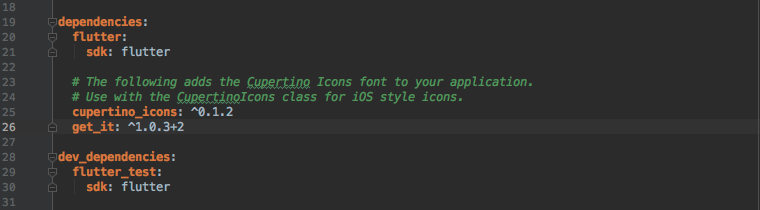

# Flutter | 通过 ServiceLocator 实现无 context 导航

# 前言
最近在开发过程中看到很多同学问过这个问题。我想要在网络请求失败的时候弹出一个统一的处理页面告诉用户检查网络连接。由于这个行为可以发生在任何页面，我们当然不希望在每一个页面之中都要重新实现一遍这个逻辑，那样耦合就太高了，这时候我们的第一反应是在网络请求后某个部分统一处理这部分逻辑。

看上去没什么问题，但是如果你做过这个需求话，你就会发现：当我们实现跳转提示页面的时候，需要使用到 `Navigator` 这个组件。回想一下我们一般是如何进行跳转的。

`Navigator.of(context).pushNamed('/errorPage');`

我们发现，要实现跳转到 ErrorPage 这个操作，我们缺少了一个重要的元素 `BuildContext`。`Navigator.of(context)` 操作其实是在祖先节点中寻找最近的一个 `NavigatorState`。而这里的 `BuildContext` 就是寻找的起点。 所以很多同学都卡在这里了，那我们就来解决这个问题。

在正式开始本文之前你需要已经理解下面几个概念：

- BuildContext ：[Flutter | 深入理解BuildContext](https://juejin.im/post/5c665cb651882562914ec153)
- Key ： [Flutter | 深入浅出Key](https://juejin.im/post/5ca2152f6fb9a05e1a7a9a26)

## 理解导航原理
>### 什么是Navigator，MaterialApp做了什么
>我们经常会在应用中打开许多页面，当我们返回的时候，它会先后退到上一个打开的页面，然后一层一层后退，没错这就是一个堆栈。而在Flutter中，则是由Navigator来负责管理维护这些页面堆栈。
``` dart
    压一个新的页面到屏幕上
    Navigator.of(context).push
    把路由顶层的页面移除
    Navigator.of(context).pop
```
>通常我们我们在构建应用的时候并没有手动去创建一个 Navigator，也能进行页面导航，这又是为什么呢。
>
>没错，这个 Navigator 正是 MaterialApp 为我们提供的。但是如果 home，routes，onGenerateRoute 和 onUnknownRoute 都为 null，并且 builder 不为 null，MaterialApp 则不会创建任何 Navigator。

既然我们的 `Navigator.of(context)` 实际上就是在获取 MaterialApp 提供的 `NavigatorState` 实例。而 `BuildContext` 跟当前 Element 有关，要统一控制实际上相当复杂。我们是否可以使用另外一种方式来获取  `Navigator`，这样就可以不再受 BuildContext 的约束了。

## 获取 Navigator 实例
要获取某个 Widget 我们在之前的文章中介绍了可以使用 `GlobalKey` 来实现。那我们应该如何获取到 `Navigator` 呢？
```dart
class _AppState extends State<App> {
  GlobalKey<NavigatorState> _navigatorKey = GlobalKey(debugLabel: 'navigate');

  @override
  Widget build(BuildContext context) {
    return MaterialApp(
      navigatorKey: _navigatorKey,
      home: HomeScreen(),
    );
  }
}
```

由于 MaterialApp 封装了 Navigator，并且将 Navigator 的 key 属性作为 navigatorKey 暴露出来，我们只需要绑定一个 GlobalKey 就行了。

但是现在问题又来了，我们假如想要在外部使用这个 GlobalKey 好像还是不太方便。我们的 Navigator 可能在多处需要使用，假如直接依赖的话每一处都包含了用于创建、定位和管理依赖项的重复代码。假如我们现在仅仅只是想进行网络调试的测试，由于依赖了 Navigator 相关的代码，想要进行测试非常困难。

这时候就需要 ServiceLocator 来帮助我们进行解耦。
# ServiceLocator
这是一种经典的设计模式，主要目的是将类与依赖解耦，让类在编译的时候并知道依赖相的具体实现。从而提升其隔离性和可测试性。

## get_it
而今天我们要介绍的是一个来自 Flutter Community 和 Thomas Burkhart 制作的库 [get_it](https://pub.dev/packages/get_it)。它是一个轻量级 ServiceLocator 库，仅仅用到了 99 行代码（包括注释）。建议有时间都去阅读一下。

### 简单上手
get_it 非常简单，使用就分两步。
- 注册服务
- 依赖注入

#### 注册服务
首先创建出一个 GetIt 容器对象。

``` dart
GetIt getIt = new GetIt();
```
然后把需要注册的服务在容器中注册。
``` dart
getIt.registerSingleton<AppModel>(new AppModelImplementation());
getIt.registerLazySingleton<RESTAPI>(() =>new RestAPIImplementation());
```
#### 依赖注入
在需要使用到这个依赖的地方我们还是通过这个容器来获取依赖。

`var myAppModel = getIt<AppModel>();`

你也可以使用 `var myAppModel = getIt.get<AppModel>();` 这个方法，效果是一样的。

由于 dart 支持全局变量，我们就把容器直接写在一个 Dart 文件中就好了。是不是很简单呢？

这样我们的服务就是在容器中创建的，在实际依赖的时候，我们可以只依赖于接口，然后通过容器注入（DI）实现了该接口的实际对象，达到了解耦的效果。

## 实现 NavigateService
现在我们来看看该如何使用 get_it 实现一个 NavigateService。
### 添加依赖



- 实际添加请参考：https://pub.dev/packages/get_it#-installing-tab-
- 由于版本冲突添加失败请参考: https://juejin.im/post/5b8958d351882542b03e6d57

### 创建全局 Locater
我们在项目中新建一个 service_locator.dart 文件。然后在这个文件中创建一个全局 GetIt 实例。

``` dart
import 'package:get_it/get_it.dart';

    final GetIt getIt = GetIt();
    void setupLocator(){}
```
这里先写上 setupLocator 方法，之后会在这里进行服务注册。

### 创建 NavigateService

我们把导航相关的功能封装成 Service，方便之后使用。
``` dart
import 'package:flutter/material.dart';

class NavigateService {
  final GlobalKey<NavigatorState> key = GlobalKey(debugLabel: 'navigate_key');

  NavigatorState get navigator => key.currentState;

  get pushNamed => navigator.pushNamed;
  get push => navigator.push;
}
```
通过 key.currentState 获取到 NavigatorState 实例。

我这里简单暴露了导航的 push 和 pushName 功能，你可以根据自己的功能来进行扩展。

### 注册服务
现在就需要在容器中注册这个服务，回到 service_locator.dart。
``` dart
void setupLocator(){
  getIt.registerSingleton(NavigateService());
}
```
通过调用 registerSingleton，我们在容器中注册了一个单例模式使用的 NavigateService。之后我们所有需要注册的 Service 都在这里注册一遍即可。

### 容器初始化
刚刚已经写好了注册函数，现在就需要在我们的 Flutter 应用运行时初始化一次，main 函数是一个不错的选择。

``` dart
void main() {
  setupLocator();
  runApp(App());
}
```
这样在我们程序运行的时候就能够把服务都初始化到容器中。

### 依赖注入
刚才我们说了，要想获得 Navigator 需要在 MaterialApp 的 navigatorKey 绑定一个 GlobalKey。所以我们现在通过容器注入服务，来绑定这个 GlobalKey。

``` dart
class App extends StatelessWidget {
  @override
  Widget build(BuildContext context) {
    return MaterialApp(
      navigatorKey: getIt<NavigateService>().key,
      routes: {'/ErrorScreen': (_) => ErrorScreen()},
      home: HomeScreen(),
    );
  }
}
```
上面通过 getIt<NavigateService>() 注入了 NavigateService 的依赖。这个 getIt 就是我们的全局实例。

然后添加了一个命名路由。这里我把 HomeScreen 和 ErrorScreen 的代码放在下面。

``` dart
class HomeScreen extends StatelessWidget {
  @override
  Widget build(BuildContext context) {
    return Scaffold(
      floatingActionButton: FloatingActionButton(onPressed: () {
        getIt<NavigateService>().pushNamed('/ErrorScreen');
      }),
    );
  }
}

class ErrorScreen extends StatelessWidget {
  @override
  Widget build(BuildContext context) {
    return Container(
      alignment: Alignment.center,
      color: Colors.red,
      child: Text('Error'),
    );
  }
}
```

在 HomeScreen 中点击一下 FloatingActionButton 就会通过注入的 NavigateService 跳转到 ErrorScreen。

在进行跳转时，我们可以看到并没有使用 context。

` getIt<NavigateService>().pushNamed('/ErrorScreen');`

这样你就可以在你想要的地方恰当的处理一些全局导航操作了。它的一个巨大的好处在于你不仅可以在 Widget 中使用，而且可以在任何地方使用容器中的服务。

## get_it 详解
### 不同的注册方式
GetIt 提供了多种注册方式，这将会影响这些对象的生命周期。目前有三种：
- 工厂模式：`void registerFactory<T>(FactoryFunc<T> func)` 每次都会返回新的实例。
- 单例模式：`void registerSingleton<T>(T instance)` 每次返回同一实例。 这种模式需要手动初始化，就像我们上面例子中那样。
- 单例模式（懒加载）： `void registerLazySingleton<T>(FactoryFunc<T> func)` 这种方式只有第一次注入依赖的时候，才会初始化服务，并且每次返回相同实例。

### 覆盖注册

如果你在容器中注册了两次同一服务的话，默认情况下会在调试模式中得到一个断言，就像下面这样。
``` dart
void setupLocator(){
  getIt.registerSingleton(NavigateService());
  getIt.registerSingleton(NavigateService());
}
```
> Failed assertion: line 53 pos 12: 'allowReassignment || !_factories.containsKey(T)': Type NavigateService is already registered

get_it 会认为你可能是写错了，所以提醒你这里注册了**两次**相同服务。如果你真的必须覆盖注册，那么你可以通过设置属性 `allowReassignment == true` 来关闭此断言。

### 重置容器
如果你想要重置所有容器，可以调用 `reset()` 方法。一般在做测试的时候会用到。

# Q&A
## ServiceLocator 与 Dependency Injection & Inversion of Control 的关系

我们在上面看到，当我们使用 ServiceLocator 之后，实现了控制反转（Ioc）。服务不再由使用者创建，而是通过容器注入。这样我们可以不再依赖于具体的实现，而是依赖于一层薄薄的的接口。这样调用者不再知道服务具体实现细节，可以很轻松的使用 mock 数据进行替换。ServiceLocator 其实就是一种特殊的控制反转。

Dependency Injection 实际上和 ServiceLocator 解决的是同样的问题。但是它又与DI的实现原理上有所不同。由于 Flutter 为了减少打包后应用体积禁用了 dart 的反射包，所以你不知道神奇注入对象的来源，这样一来大多数依赖于反射的 DI 包也就没法用了。

## 获取服务的性能
我们可以从 get_it 的源码中看到，这个 ServiceLocator 就是用一个 map 在储存数据。

``` dart
final _factories = new Map<Type, _ServiceFactory<dynamic>>();
```
所以获取服务的性能是 O(1)。

# 写在最后
本文参考了以下资料：
- [Navigate without context in Flutter with a Navigation Service](https://www.filledstacks.com/snippet/navigate-without-context-in-flutter-with-a-navigation-service)
- [One to find them all: How to use Service Locators with Flutter](https://www.burkharts.net/apps/blog/one-to-find-them-all-how-to-use-service-locators-with-flutter/)

感兴趣的同学可以去阅读一下大师的文章。

这次介绍的库非常轻量，你可以很快速的上手它。这里你可能会觉得它与 InheritWidget 有些相似。虽然都在解决模型依赖问题，get_it 不仅能够在 Widget tree 中进行使用，而且能够解决模型间的依赖问题。大家可以根据自己项目的情况来选择使用。

如果文章中还存在任何问题还请指正！欢迎在下方评论区以及我的邮箱1652219550a@gmail.com 一起讨论，我会及时回复！
