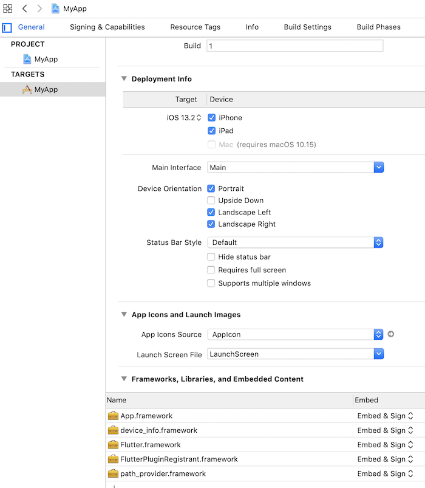
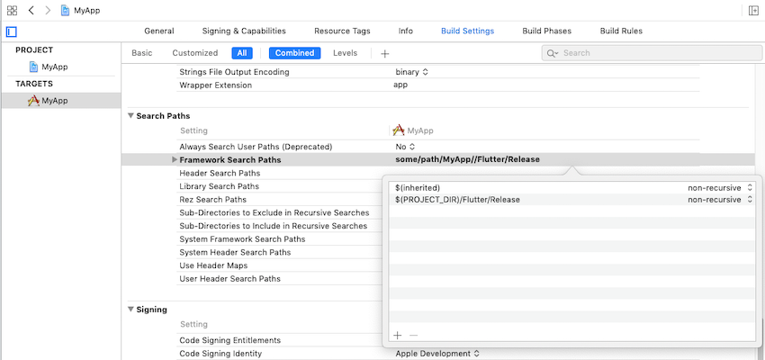

> Flutter 能以 framework 的形式添加到你的既有 iOS 应用中。本文将讲解如何做到这一点。

# 集成

## 系统要求

你的开发环境必须满足 [Flutter 对 macOS 系统的版本要求](https://flutter.cn/docs/get-started/install/macos#system-requirements)
并 [已经安装 Xcode](https://flutter.cn/docs/get-started/install/macos#install-xcode)，Flutter 支持 iOS 8.0 及以上。

## 创建 Flutter module

为了将 Flutter 集成到你的既有应用里，第一步要创建一个 Flutter module。

在命令行中执行：

```sh
cd some/path/
flutter create --template module my_flutter
```

Flutter module 会创建在 `some/path/my_flutter/` 目录。
在这个目录中，你可以像在其它 Flutter 项目中一样，执行 `flutter` 命令。
比如 `flutter run --debug` 或者 `flutter build ios`。
你也同样可以在 [Android Studio/IntelliJ](https://flutter.cn/docs/development/tools/android-studio) 或者 [VS Code](https://flutter.cn/docs/development/tools/vs-code) 中运行这个模块，
并附带 Flutter 和 Dart 插件。在集成到既有应用前，
这个项目在 Flutter module 中包含了一个单视图的示例代码，
对 Flutter 侧代码的测试会有帮助。

### 模块组织

在 `my_flutter` 模块，目录结构和普通 Flutter 应用类似：

```text
my_flutter/
├─.ios/
│ ├─Runner.xcworkspace
│ └─Flutter/podhelper.rb
├─lib/
│ └─main.dart
├─test/
└─pubspec.yaml
```

添加你的 Dart 代码到 `lib/` 目录。

添加 Flutter 依赖到 `my_flutter/pubspec.yaml`，
包括 Flutter packages 和 plugins。

`.ios/` 隐藏文件夹包含了一个 Xcode workspace，用于单独运行你的 Flutter module。
它是一个独立启动 Flutter 代码的壳工程，并且包含了一个帮助脚本，
用于编译 framewroks 或者使用 [CocoaPods](https://cocoapods.org) 将 Flutter module 集成到你的既有应用。

> iOS 代码要添加到你的既有应用或者 Flutter plugin 中，
> 而不是 Flutter module 的 `.ios/` 目录下。
> `.ios/` 下的改变不会集成到你的既有应用。
> 在 `my_flutter` 执行 `flutter clean`
> 或者 `flutter pub get` 会重新生成这个目录。

## 在你的既有应用中集成 Flutter module

这里有两种方式可以将 Flutter 集成到你的既有应用中。

1. 使用 CocoaPods 依赖管理和已安装的 Flutter SDK 。（推荐）

2. 把 Flutter engine 、你的 dart 代码和所有 Flutter plugin 编译成 framework 。然后用 Xcode 手动集成到你的应用中，并更新编译设置。

> 你的应用将不能在模拟器上运行 Release 模式，
> 因为 Flutter 还不支持将 Dart 代码编译成 x86 ahead-of-time (AOT) 模式的二进制文件。
> 你可以在模拟机和真机上运行 Debug 模式，在真机上运行 Release 模式。

使用 Flutter 会 [增加应用体积](https://flutter.cn/docs/resources/faq#how-big-is-the-flutter-engine) 。

### 选项 A - 使用 CocoaPods 和 Flutter SDK 集成

这个方法需要你的项目的所有开发者，都在本地安装 Flutter SDK。
只需要在 Xcode 中编译应用，就可以自动运行脚本来集成 dart 代码和 plugin。
这个方法允许你使用 Flutter module 中的最新代码快速迭代开发，
而无需在 Xcode 以外执行额外的命令。

下面的示例假设你的既有应用和 Flutter module 在相邻目录。如果你有不同的目录结构，需要适配到对应的路径。

```text
some/path/
├── my_flutter/
│   └── .ios/
│       └── Flutter/
│         └── podhelper.rb
└── MyApp/
    └── Podfile
```

如果你的应用（`MyApp`）还没有 Podfile，根据 [CocoaPods getting started guide](https://guides.cocoapods.org/using/using-cocoapods.html) 来在项目中添加 `Podfile`。

1. 在 `Podfile` 中添加下面代码：

```ruby
# MyApp/Podfile

flutter_application_path = '../my_flutter'
load File.join(flutter_application_path, '.ios', 'Flutter', 'podhelper.rb')
```

2. 每个需要集成 Flutter 的 Podfile target，执行`install_all_flutter_pods(flutter_application_path)`：

```ruby
# MyApp/Podfile

target 'MyApp' do
	install_all_flutter_pods(flutter_application_path)
end
```

3. 运行 `pod install`。

> 当你在 `my_flutter/pubspec.yaml` 改变了 Flutter plugin 依赖，
> 需要在 Flutter module 目录运行 `flutter pub get`，
> 来更新会被`podhelper.rb` 脚本用到的 plugin 列表，
> 然后再次在你的应用目录 `some/path/MyApp` 运行 `pod install`.

`podhelper.rb` 脚本会把你的 plugins，
`Flutter.framework`，和 `App.framework` 集成到你的项目中。

你应用的 Debug 和 Release 编译配置，将会集成相对应的 
Debug 或 Release 的 [编译产物](https://flutter.cn/docs/testing/build-modes)。
可以增加一个 Profile 编译配置用于在 profile 模式下测试应用。

> `Flutter.framework` 是 Flutter engine 的框架，
> `App.framework` 是你的 Dart 代码的编译产物。

在 Xcode 中打开 `MyApp.xcworkspace` ，你现在可以使用 `⌘B` 编译项目了。

### 选项 B - 在 Xcode 中集成 frameworks

除了上面的方法，你也可以创建必备的 frameworks，手动修改既有 Xcode 项目，将他们集成进去。
当你组内其它成员们不能在本地安装 Flutter SDK 和 CocoaPods，
或者你不想使用 CocoaPods 作为既有应用的依赖管理时，这种方法会比较合适。
但是每当你在 Flutter module 中改变了代码，
都必须运行 `flutter build ios-framework`。

如果你使用前面的 “使用 CocoaPods 和 Flutter SDK 集成” ，你可以跳过本步骤。

下面的示例假设你想在 `some/path/MyApp/Flutter/` 目录下创建 frameworks：

```sh
flutter build ios-framework --output=some/path/MyApp/Flutter/
```

```text
some/path/MyApp/
└── Flutter/
    ├── Debug/
    │   ├── Flutter.framework
    │   ├── App.framework
    │   ├── FlutterPluginRegistrant.framework
    │   └── example_plugin.framework (each plugin with iOS platform code is a separate framework)
      ├── Profile/
      │   ├── Flutter.framework
      │   ├── App.framework
      │   ├── FlutterPluginRegistrant.framework
      │   └── example_plugin.framework
      └── Release/
          ├── Flutter.framework
          ├── App.framework
          ├── FlutterPluginRegistrant.framework
          └── example_plugin.framework
```

> 在 Xcode 11 中， 你可以添加 `--xcframework --no-universal` 参数来生成 XCFrameworks，而不是通用 framework。

在 Xcode 中将生成的 frameworks 集成到你的既有应用中。
例如，你可以在 `some/path/MyApp/Flutter/Release/` 
目录拖拽 frameworks 到 你的应用 target 编译设置的 
General > Frameworks, Libraries, and Embedded Content 下，
然后在 Embed 下拉列表中选择 "Embed & Sign"。



在 target 的编译设置中的 Framework Search Paths (`FRAMEWORK_SEARCH_PATHS`) 增加 `$(PROJECT_DIR)/Flutter/Release/`。



在 Xcode 项目中即成 frameworks 有很多方法 —— 选择最适合你的项目的。

你现在可以在 Xcode中使用 `⌘B` 编译项目。

> 如果你想在 Debug 编译配置下使用 Debug 版本的 Flutter frameworks，
> 在 Release 编译配置下使用 Release 版本的 Flutter frameworks，
> 在 `MyApp.xcodeproj/project.pbxproj` 文件中，
> 尝试在所有 Flutter 相关 frameworks 上使用
> `path = "Flutter/$(CONFIGURATION)/example.framework";`
> 替换 `path = Flutter/Release/example.framework;` 
> （注意添加引号 `"`）。

> 你也必须在 Framework Search Paths 编译设置中使用 `$(PROJECT_DIR)/Flutter/$(CONFIGURATION)`。

# 开发

下面我们在既有 iOS 应用中添加单个 Flutter 页面。

## 启动 FlutterEngine 和 FlutterViewController

为了在既有 iOS 应用中展示 Flutter 页面，请启动 [`FlutterEngine`](https://api.flutter-io.cn/objcdoc/Classes/FlutterEngine.html) 和 [`FlutterViewController`](https://api.flutter-io.cn/objcdoc/Classes/FlutterViewController.html)。

> `FlutterEngine` 充当 Dart VM 和 Flutter 运行时的主机；
> `FlutterViewController` 依附于 `FlutterEngine`，给 Flutter 传递 UIKit 的输入事件，并展示被 `FlutterEngine` 渲染的每一帧画面。

`FlutterEngine` 的寿命可能与 `FlutterViewController` 相同，也可能超过 `FlutterViewController`。


> 通常建议为您的应用预热一个“长寿”的 `FlutterEngine` 是因为:
> 
> - 当展示 `FlutterViewController` 时，第一帧画面将会更快展现；
> 
> - 你的 Flutter 和 Dart 状态将比一个`FlutterViewController` 存活更久；
>   
> - 在展示 UI 前，你的应用和 plugins 可以与 Flutter 和 Dart 逻辑交互。


[加载顺序和性能](https://flutter.cn/docs/development/add-to-app/performance) 里有更多关于预热 engine 的延迟和内存取舍的分析。

### 创建一个 FlutterEngine


创建 `FlutterEngine` 的合适位置取决于您的应用。作为示例，我们将在应用启动的 app delegate 中创建一个 `FlutterEngine`， 并作为属性暴露给外界。

如果你使用 Objective-C
**在 `AppDelegate.h`:**

```objectivec
// AppDelegate.h

@import UIKit;
@import Flutter;

@interface AppDelegate : FlutterAppDelegate // 以下有关于 FlutterAppDelegate 的更多信息
@property (nonatomic,strong) FlutterEngine *flutterEngine;
@end
```

**在 `AppDelegate.m`:**

```objectivec
// AppDelegate.m

#import <FlutterPluginRegistrant/GeneratedPluginRegistrant.h> // Used to connect plugins.

#import "AppDelegate.h"

@implementation AppDelegate

- (BOOL)application:(UIApplication *)application
    didFinishLaunchingWithOptions:(NSDictionary<UIApplicationLaunchOptionsKey, id> *)launchOptions {
  self.flutterEngine = [[FlutterEngine alloc] initWithName:@"my flutter engine"];
  // 使用默认 Flutter 路由运行默认 Dart 入口
  [self.flutterEngine run];
  [GeneratedPluginRegistrant registerWithRegistry:self.flutterEngine];
  return [super application:application didFinishLaunchingWithOptions:launchOptions];
}

@end
```

如果你使用 Swift

**在 `AppDelegate.swift`:**

```swift
// AppDelegate.swift

import UIKit
import Flutter
import FlutterPluginRegistrant // 用于连接 plugins

@UIApplicationMain
class AppDelegate: FlutterAppDelegate { // FlutterAppDelegate 有更多信息
  lazy var flutterEngine = FlutterEngine(name: "my flutter engine")

  override func application(_ application: UIApplication, didFinishLaunchingWithOptions launchOptions: [UIApplication.LaunchOptionsKey: Any]?) -> Bool {
    // 使用默认 Flutter 路由运行默认 Dart 入口
    flutterEngine.run();
    GeneratedPluginRegistrant.register(with: self.flutterEngine);
    return super.application(application, didFinishLaunchingWithOptions: launchOptions);
  }
}
```

### 使用 FlutterEngine 展示 FlutterViewController

下面的例子展示了一个普通的 ViewController，包含一个 present `FlutterViewController` 的按钮。

如果你使用 Objective-C

```objectivec
// ViewController.m

@import Flutter;
#import "AppDelegate.h"
#import "ViewController.h"

@implementation ViewController
- (void)viewDidLoad {
    [super viewDidLoad];

    // 制作一个按钮，当点击的时候调用 showFlutter 方法
    UIButton *button = [UIButton buttonWithType:UIButtonTypeCustom];
    [button addTarget:self
               action:@selector(showFlutter)
     forControlEvents:UIControlEventTouchUpInside];
    [button setTitle:@"Show Flutter!" forState:UIControlStateNormal];
    button.backgroundColor = UIColor.blueColor;
    button.frame = CGRectMake(80.0, 210.0, 160.0, 40.0);
    [self.view addSubview:button];
}

- (void)showFlutter {
    FlutterEngine *flutterEngine =
        ((AppDelegate *)UIApplication.sharedApplication.delegate).flutterEngine;
    FlutterViewController *flutterViewController =
        [[FlutterViewController alloc] initWithEngine:flutterEngine nibName:nil bundle:nil];
    [self presentViewController:flutterViewController animated:YES completion:nil];
}
@end
```

如果你使用 Swift

```swift
// ViewController.swift

import UIKit
import Flutter

class ViewController: UIViewController {
  override func viewDidLoad() {
    super.viewDidLoad()

    // 制作一个按钮，当点击的时候调用 showFlutter 方法
    let button = UIButton(type:UIButton.ButtonType.custom)
    button.addTarget(self, action: #selector(showFlutter), for: .touchUpInside)
    button.setTitle("Show Flutter!", for: UIControl.State.normal)
    button.frame = CGRect(x: 80.0, y: 210.0, width: 160.0, height: 40.0)
    button.backgroundColor = UIColor.blue
    self.view.addSubview(button)
  }

  @objc func showFlutter() {
    let flutterEngine = (UIApplication.shared.delegate as! AppDelegate).flutterEngine
    let flutterViewController =
        FlutterViewController(engine: flutterEngine, nibName: nil, bundle: nil)
    present(flutterViewController, animated: true, completion: nil)
  }
}
```

现在，你的 iOS 应用中集成了一个 Flutter 页面。

> 在上一个例子中，你的默认 Dart 库的默认入口函数 `main()`，将会在 `AppDelegate` 创建 `FlutterEngine` 并调用 `run` 方法时调用。

### *或者* —— 使用隐式 FlutterEngine 创建 FlutterViewController

上一个示例还有另一个选择，你可以让 `FlutterViewController`
隐式创建它自己的 `FlutterEngine`，而不用提前预热 engine。

不过不建议这样做，因为按需创建`FlutterEngine` 的话，在 `FlutterViewController` 被 present 出来之后，第一帧图像渲染完之前，将会引入明显的延迟。但是当 Flutter 页面很少被展示时，当对决定何时启动 Dart VM 没有好的启发时，当 Flutter 无需在页面（view controller）之间保持状态时，此方式可能会有用。

为了不使用已经存在的 `FlutterEngine` 来展现 `FlutterViewController`，
省略 `FlutterEngine` 的创建步骤，
并且在创建 `FlutterViewController` 时，去掉 engine 的引用。

如果你使用 Objective-C

```objectivec
// "ViewController.m

// 省略已经存在的代码
- (void)showFlutter {
  FlutterViewController *flutterViewController =
      [[FlutterViewController alloc] initWithProject:nil nibName:nil bundle:nil];
  [self presentViewController:flutterViewController animated:YES completion:nil];
}
@end
```

如果你使用 Swift

```swift
// ViewController.swift

// 省略已经存在的代码
func showFlutter() {
  let flutterViewController = FlutterViewController(project: nil, nibName: nil, bundle: nil)
  present(flutterViewController, animated: true, completion: nil)
}
```

查看 [加载顺序和性能](https://flutter.cn/docs/development/add-to-app/performance) 了解更多关于延迟和内存使用的探索。

## 使用 FlutterAppDelegate

推荐让你应用的 `UIApplicationDelegate` 继承 `FlutterAppDelegate`，但不是必须的。

`FlutterAppDelegate` 有这些功能：

- 传递应用的回调，例如
  [`openURL`](https://developer.apple.com/documentation/uikit/uiapplicationdelegate/1623112-application)，
  到 Flutter plugins，例如 [local_auth](https://pub.dev/packages/local_auth)；
  
- 传递状态栏点击（这只能在 AppDelegate 中检测）到 Flutter 的点击置顶行为。

如果你的 app delegate 不能直接继承 `FlutterAppDelegate`，
让你的 app delegate 实现 `FlutterAppLifeCycleProvider` 协议，
来确保 Flutter plugins 接收到必要的回调。
否则，依赖这些事件的 plugins 将会有无法预估的行为。


例如：

```objectivec
// AppDelegate.h

@import Flutter;
@import UIKit;
@import FlutterPluginRegistrant;

@interface AppDelegate : UIResponder <UIApplicationDelegate, FlutterAppLifeCycleProvider>
@property (strong, nonatomic) UIWindow *window;
@property (nonatomic,strong) FlutterEngine *flutterEngine;
@end
```

App delegate 的实现中，应该最大化地委托给 `FlutterPluginAppLifeCycleDelegate`：

```objectivec
// AppDelegate.m 

@interface AppDelegate ()
@property (nonatomic, strong) FlutterPluginAppLifeCycleDelegate* lifeCycleDelegate;
@end

@implementation AppDelegate

- (instancetype)init {
    if (self = [super init]) {
        _lifeCycleDelegate = [[FlutterPluginAppLifeCycleDelegate alloc] init];
    }
    return self;
}

- (BOOL)application:(UIApplication*)application
didFinishLaunchingWithOptions:(NSDictionary<UIApplicationLaunchOptionsKey, id>*))launchOptions {
    self.flutterEngine = [[FlutterEngine alloc] initWithName:@"io.flutter" project:nil];
    [self.flutterEngine runWithEntrypoint:nil];
    [GeneratedPluginRegistrant registerWithRegistry:self.flutterEngine];
    return [_lifeCycleDelegate application:application didFinishLaunchingWithOptions:launchOptions];
}

// 返回 key window 的 rootViewController, 如果它是一个 FlutterViewController
// Otherwise, returns nil.
- (FlutterViewController*)rootFlutterViewController {
    UIViewController* viewController = [UIApplication sharedApplication].keyWindow.rootViewController;
    if ([viewController isKindOfClass:[FlutterViewController class]]) {
        return (FlutterViewController*)viewController;
    }
    return nil;
}

- (void)touchesBegan:(NSSet*)touches withEvent:(UIEvent*)event {
    [super touchesBegan:touches withEvent:event];

    // 传递状态栏的点击到 key window 上 Flutter 的 rootViewController
    if (self.rootFlutterViewController != nil) {
        [self.rootFlutterViewController handleStatusBarTouches:event];
    }
}

- (void)application:(UIApplication*)application
didRegisterUserNotificationSettings:(UIUserNotificationSettings*)notificationSettings {
    [_lifeCycleDelegate application:application
didRegisterUserNotificationSettings:notificationSettings];
}

- (void)application:(UIApplication*)application
didRegisterForRemoteNotificationsWithDeviceToken:(NSData*)deviceToken {
    [_lifeCycleDelegate application:application
didRegisterForRemoteNotificationsWithDeviceToken:deviceToken];
}

- (void)application:(UIApplication*)application
didReceiveRemoteNotification:(NSDictionary*)userInfo
fetchCompletionHandler:(void (^)(UIBackgroundFetchResult result))completionHandler {
    [_lifeCycleDelegate application:application
       didReceiveRemoteNotification:userInfo
             fetchCompletionHandler:completionHandler];
}

- (BOOL)application:(UIApplication*)application
            openURL:(NSURL*)url
            options:(NSDictionary<UIApplicationOpenURLOptionsKey, id>*)options {
    return [_lifeCycleDelegate application:application openURL:url options:options];
}

- (BOOL)application:(UIApplication*)application handleOpenURL:(NSURL*)url {
    return [_lifeCycleDelegate application:application handleOpenURL:url];
}

- (BOOL)application:(UIApplication*)application
            openURL:(NSURL*)url
  sourceApplication:(NSString*)sourceApplication
         annotation:(id)annotation {
    return [_lifeCycleDelegate application:application
                                   openURL:url
                         sourceApplication:sourceApplication
                                annotation:annotation];
}

- (void)application:(UIApplication*)application
performActionForShortcutItem:(UIApplicationShortcutItem*)shortcutItem
  completionHandler:(void (^)(BOOL succeeded))completionHandler NS_AVAILABLE_IOS(9_0) {
    [_lifeCycleDelegate application:application
       performActionForShortcutItem:shortcutItem
                  completionHandler:completionHandler];
}

- (void)application:(UIApplication*)application
handleEventsForBackgroundURLSession:(nonnull NSString*)identifier
  completionHandler:(nonnull void (^)(void))completionHandler {
    [_lifeCycleDelegate application:application
handleEventsForBackgroundURLSession:identifier
                  completionHandler:completionHandler];
}

- (void)application:(UIApplication*)application
performFetchWithCompletionHandler:(void (^)(UIBackgroundFetchResult result))completionHandler {
    [_lifeCycleDelegate application:application performFetchWithCompletionHandler:completionHandler];
}

- (void)addApplicationLifeCycleDelegate:(NSObject<FlutterPlugin>*)delegate {
    [_lifeCycleDelegate addDelegate:delegate];
}
@end
```

## 启动选项

例子中展示了使用默认启动选项运行 Flutter。

为了定制化你的 Flutter 运行时，你也可以置顶 Dart 入口、库和路由。

### Dart 入口

在 `FlutterEngine` 上调用 `run`，默认将会调用你的 `lib/main.dart` 文件里的 `main()` 函数。

你也可以使用另一个入口方法 
[`runWithEntrypoint`](https://api.flutter-io.cn/objcdoc/Classes/FlutterEngine.html#/c:objc(cs)FlutterEngine(im)runWithEntrypoint:)，
并使用 `NSString` 字符串指定一个不同的 Dart 入口。

> 使用 `main()` 以外的 Dart 入口函数，必须使用下面的注解，
> 防止被 [tree-shaking](https://en.wikipedia.org/wiki/Tree_shaking) 优化掉，而没有编译。
> 
> ```dart
> // main.dart
> 
> @pragma('vm:entry-point')
> void myOtherEntrypoint() { ... };
> ```

### Dart 库

另外，在指定 Dart 函数时，你可以指定特定文件的特定函数。

下面的例子使用 `lib/other_file.dart` 文件的
`myOtherEntrypoint()` 函数取代 `lib/main.dart` 的 `main()` 函数：

如果你使用 Objective-C

```objectivec
[flutterEngine runWithEntrypoint:@"myOtherEntrypoint" libraryURI:@"other_file.dart"];
```

如果你使用 Swift

```swift
flutterEngine.run(withEntrypoint: "myOtherEntrypoint", libraryURI: "other_file.dart")
```

### 路由

当构建 engine 时，可以为你的 Flutter [`WidgetsApp`](https://api.flutter-io.cn/flutter/widgets/WidgetsApp-class.html) 设置一个初始路由。

如果你使用 Objective-C

```objectivec
FlutterEngine *flutterEngine =
    [[FlutterEngine alloc] initWithName:@"my flutter engine"];
[[flutterEngine navigationChannel] invokeMethod:@"setInitialRoute"
                                      arguments:@"/onboarding"];
[flutterEngine run];
```

如果你使用 Swift

```swift
let flutterEngine = FlutterEngine(name: "my flutter engine")
flutterEngine.navigationChannel.invokeMethod("setInitialRoute", arguments:"/onboarding")
flutterEngine.run()
```

这段代码使用 `"/onboarding"` 取代 `"/"`，作为你的 `dart:ui` 的 [`window.defaultRouteName`](https://api.flutter-io.cn/flutter/dart-ui/Window/defaultRouteName.html)

> 请注意：
> 
> `navigationChannel` 上的 `"setInitialRoute"`
> 必须在启动 `FlutterEngine` 前调用，才能在 Flutter 的第一帧中显示期望的路由。
> 
> 特别是，它必须在运行 Dart 入口函数前被调用。入口函数可能会引起一系列的事件，
> 因为 [`runApp`]({{site.api}}/flutter/widgets/runApp.html)
> 搭建了一个 Material/Cupertino/WidgetsApp，
> 进而隐式创建了一个 [Navigator]({{site.api}}/flutter/widgets/Navigator-class.html)，
> Navigator 又可能在第一次初始化
> [`NavigatorState`]({{site.api}}/flutter/widgets/NavigatorState-class.html)
> 时读取 `window.defaultRouteName`。
> 
> 运行 engine 后设置初始化路由，将不会有作用.


另外

> 如果在 `FlutterEngine` 启动后，迫切得需要在平台侧改变你当前的 Flutter 路由，
> 可以使用 `FlutterViewController` 里的
> [pushRoute](https://api.flutter-io.cn/objcdoc/Classes/FlutterViewController.html#/c:objc(cs)FlutterViewController(im)pushRoute:)
> 或者
> [popRoute](https://api.flutter-io.cn/objcdoc/Classes/FlutterViewController.html#/c:objc(cs)FlutterViewController(im)popRoute)。
> 
> 在 Flutter 侧推出 iOS 路由，调用
> [`SystemNavigator.pop()`](https://api.flutter-io.cn/flutter/services/SystemNavigator/pop.html)。

查看 [路由和导航](https://flutter.cn/docs/development/ui/navigation) 了解更多 Flutter 路由的内容。

### 其它

之前的例子仅仅展示了怎样定制 Flutter 实例初始化的几种方式，
通过 [撰写双端平台代码](https://flutter.cn/docs/development/platform-integration/platform-channels)，
你可以在 `FlutterViewController` 展示 Flutter UI 之前，
自由地选择你喜欢的，推入数据和准备 Flutter 环境的方式。

# 参考文献

本文由作者翻译的两篇 Flutter 官方文档合并而成

- [将 Flutter module 集成到 iOS 项目](https://flutter.cn/docs/development/add-to-app/ios/project-setup)
- [在 iOS 应用中添加 Flutter 页面](https://flutter.cn/docs/development/add-to-app/ios/add-flutter-screen)
